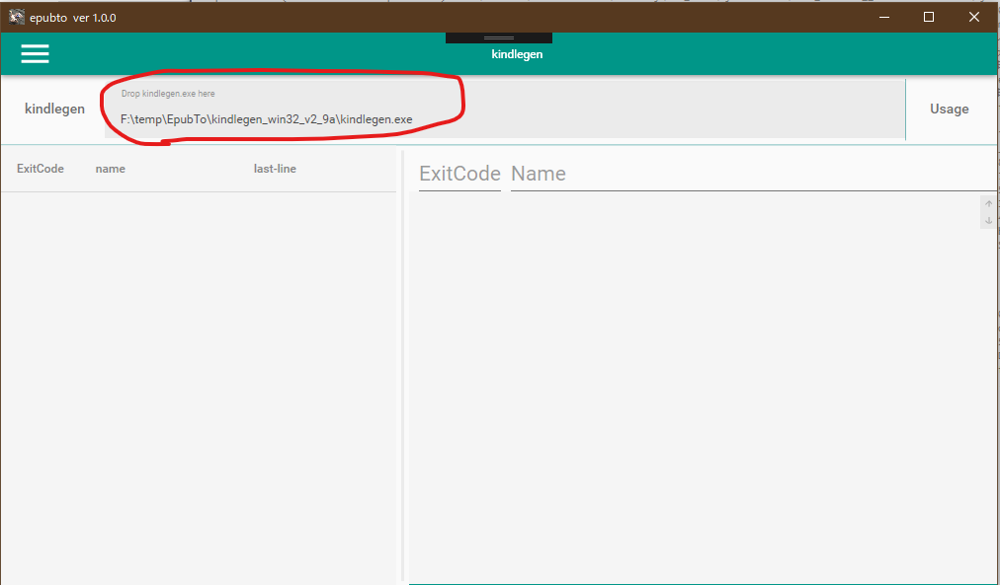
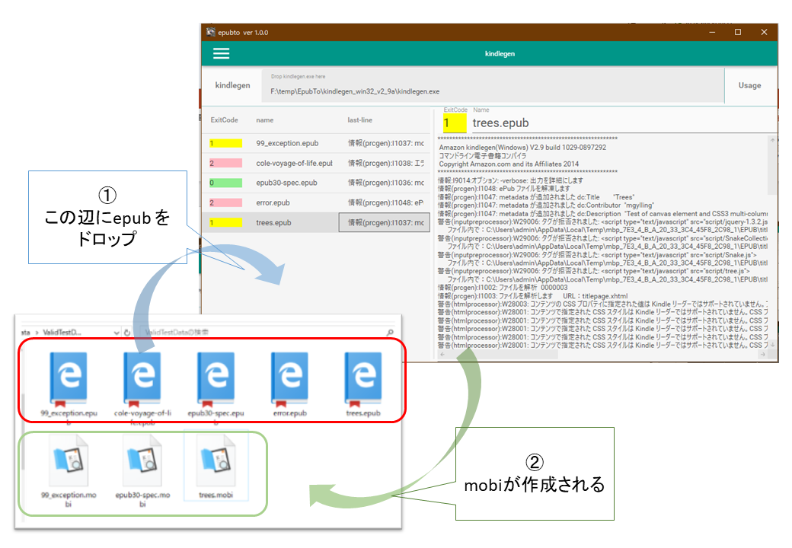
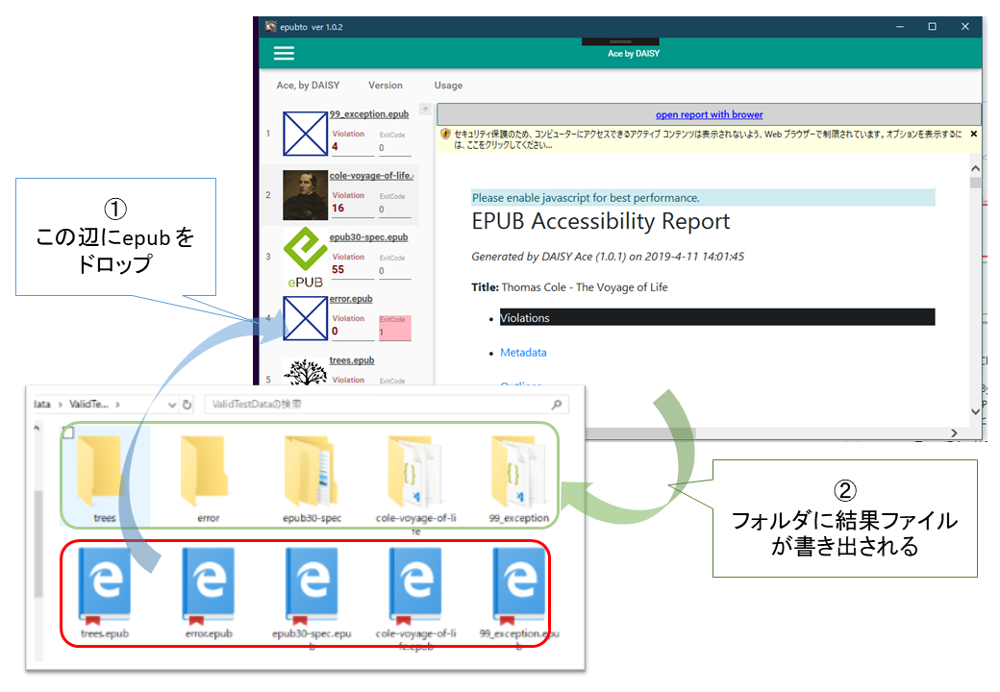

# epubto

- EPUBからMOBIへの変換を、ほんの少しだけ簡単にします。

- Make the conversion(epub to mobi) a little easier

- For Windows OS only (.net 4.7.2)

## Description

## convert: epub to mobi

0. EPUBからMOBIへの変換は kindlegenを利用できます。
1. これにUIをつけました。
2. 複数の変換を一括で行えます。

- KindleGen [[download page (amazon)]](https://www.amazon.com/gp/feature.html?ie=UTF8&docId=1000765211)

## check: Ace by DAISY

0. EPUBのアクセシビリティをチェックするツールをDAISYコンソーシアムが出してます。
1. これにUIをつけました。
2. 複数の変換を一括で行えます。

- Ace, by DAISY [[web page (DAISY Consortium)]](https://daisy.github.io/ace/)

## Installation

setup.exeでインストールできます

### mobi変換したい場合の追加準備：

1. kindlegenをダウンロードし解凍します。
2. 本アプリを起動します。kindlegen.exeファイル を、UI上の所定の場所にドロップします。

### Ace でチェックしたい場合の追加準備：

- Ace ページにある Installation の手順に沿ってインストールを完了します。
- Ace - Installation [[Installation page (DAISY Consortium)]](https://daisy.github.io/ace/getting-started/installation/)

- 本アプリとは関係なく Aceを実行できるか、確認しておいてください。

## Usage

### Usage: convert epub to mobi

0. メニューからKindlegenを選択します（初期選択状態です）
1. アプリの左側に EPUBをドロップします。（処理が始まります）
2. EPUBとフォルダと同じフォルダに、MOBIファイルが作成されます。
- エラーの場合、MOBIは作成されません。

### Usage:  Accessibility Checker for EPUB

0. メニューからAceByDaisyを選択します
1. アプリの左側に EPUBをドロップします。（処理が始まります）
2. EPUBとフォルダと同じフォルダに、結果フォルダが作成されます。
- エラーの場合、結果ファイルは作成されません。（フォルダはできる）

以上